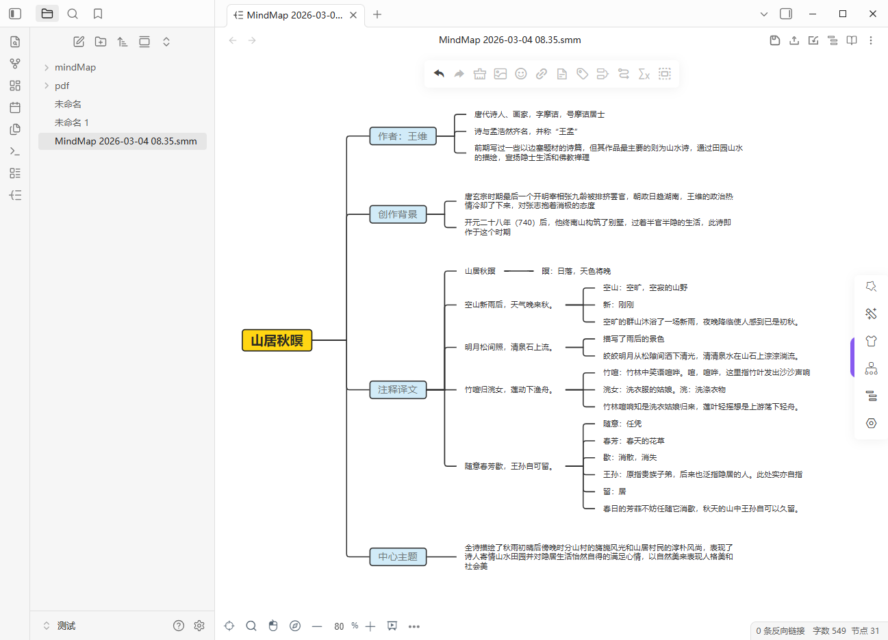
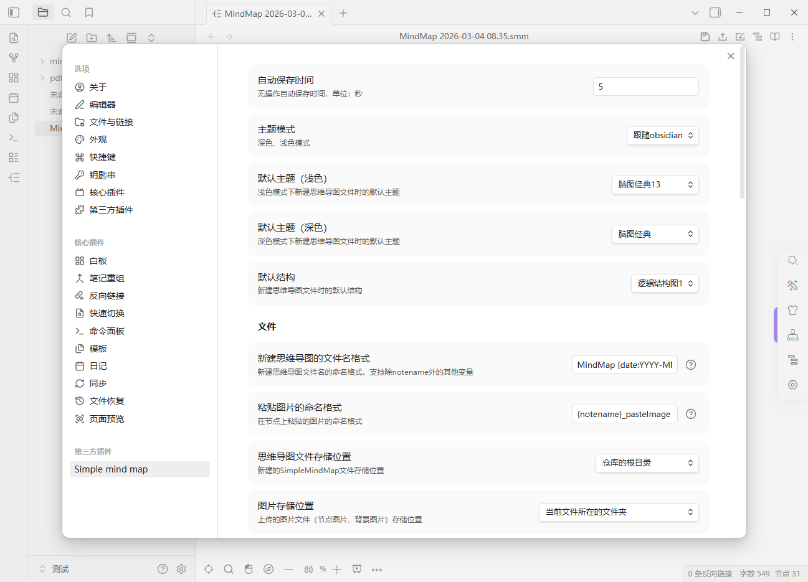

【English | [简体中文](./README_zh.md)】

# SimpleMindMap Plugin

Provides a user-friendly mind map plugin for Obsidian.

The mind map functionality is built upon the [mind-map](https://github.com/wanglin2/mind-map) project, which offers a JavaScript mind map library and a complete online version.

mind-map also provides a standalone mind map client. Learn more about the [Client](https://github.com/wanglin2/mind-map/releases).

Download standalone client(Windows、macOS、Linux): [Click here](https://github.com/wanglin2/mind-map/releases)

How to install: [中文](./docs/install_zh.md) | [English](./docs/install.md)

Changelog: [中文](./docs/changelog_zh.md) | [English](./docs/changelog.md)

Help: [中文](./docs/help_zh.md) | [English](./docs/help.md)

Image Hosting Help: [中文](./docs/imageHosting_zh.md) | [English](./docs/imageHosting.md)

# Feature List

- For mind map features, refer to the [mind-map](https://github.com/wanglin2/mind-map) project. You can also check [Common Issues](./Help.md) here.

- Mind Map File Format  
  Format: `xxx.smm.md`. File contents include: metadata (file links, tags: simplemindmap), compressed encoded mind map data, compressed encoded image data, and internal link data.  
  **Do not remove `.smm` when renaming files**, or it may fail to be recognized.

- Views  
  `xxx.smm.md` files open in mind map view by default. To open in Markdown view:  
  Method 1: Right-click the file → 【Open as Markdown Document】  
  Method 2: In mind map view → Top-right 【More】 button → 【Open as Markdown Document】
  There will be a guide prompt when entering the plugin for the first time

- Create New Mind Map Files  
  Three methods:  
  
  1. Click the ribbon icon on the left  
  2. Right-click folder → 【New Mind Map】  
3. Use command: 【New Mind Map】  
  
- Commands  
  Plugin provides Obsidian commands:  
  1. New Mind Map  
  
  2. New Mind Map and Insert into Current Document (md file)  

  Type 【smm】 to quickly search for commands.
  
- Settings  
  Plugin settings include:  
  1. Theme mode (Dark/Light/Follow Obsidian)  
  2. Default theme  
  3. Default structure  
  4. There are three ways to set the storage directory for mind map files: repository root directory, specified folder, and the folder where the current file is located, The directory supports both input and selection methods
  5. The image file storage directory and file storage directory support four ways of setting: warehouse root directory, specified folder, folder where the current file is located, and specified subfolders under the folder where the current file is located
  6. Auto-save time after inactivity  
  7. When embedding preview, double-click to open a new window
  8. Is the embedded preview background transparent
  9. Create a prefix and date timestamp format for the file name of a new mind map

- Multilingual Support  
  Supports Chinese, English, Vietnamese, Traditional Chinese. Automatically switches with Obsidian language.

- Obsidian Internal Links  
  - Add Obsidian file links to node hyperlinks:  
    1. Activate a node  
    2. Click 【Hyperlink】 icon in toolbar  
    3. Switch to 【Obsidian File】 in popup  
    4. Select an Obsidian file (supports search)  
    5. Click 【Add】  
    6. Click node's hyperlink icon to open linked file  
    7. Hyperlink icons distinguish between websites and Obsidian files.  
  - Internal links are stored in file data for Obsidian backlink parsing.
  - Hyperlinks support adding local files:
    1.Switch to 'Local Files' in the pop-up window that opens, and the selected file will be uploaded to the vault;
    2.The storage path for uploading files can be modified in the settings (files that Obsidian cannot recognize may not be displayed in the list and can be opened and viewed through the computer resource manager);

- Custom Icon Buttons (Top-right of Mind Map View)  
  - **Save and Update Image Data**:  
    Saves data + exports mind map as image → Embeds ![[]] in Markdown.  
  - **Export**: Opens export dialog.  
  - **Import**: Opens import dialog.  
  - **Switch to Outline Mode**:  
    1. Toggles outline editing mode.  
    2. 【Save】 replaces 【Save and Update Image Data】; 【Export】 hides; 【Print Outline】 appears.  
    3. Button becomes 【Switch to Mind Map Mode】 to revert.  
  - Switch between read-only/edit mode:
    After switching to read-only mode, the save , import and export buttons will be hidden
  - **Saving Status**: 【Saving...】 appears left of save button.

- Split View Synchronization  
  1. Two mind map views: Edits sync after save.  
  2. Mind map + Outline views: Edits sync after save.

- Embed Preview  
  Embed mind map files via ![[]] in Markdown:  
  
  - Displays image if available; double-click opens file.  
  - Shows 【No preview image available】 if no image; double-click opens file.  
  - **Requires manual trigger** of 【Save and Update Image Data】. Auto-save doesn't update images.  
  - Embedded previews auto-update when source file changes.  
  - If there is image data in the mind map, the embedded image should be in PNG format; otherwise, it should be in SVG format.
  - Support setting whether the embedded image background is transparent in the settings.
- Adjust width: `[[xxx.smm|300]]`.
  
- Status Bar (Bottom-right)  
  Hides Obsidian's word/character count.  
  Shows mind map word count and node count.

- Persistent Settings  
  Changes in 【Basic Style】/【Settings】 sidebar persist in plugin config.

- Node Images  
  - Select images from current Vault in node image dialog.  
  - Images pasted/dragged into nodes upload to Vault (folder configurable in settings).  
  - Drag Vault images directly into dialog.  
  - Format conversions during import/export (smm/json/xmind):  
    - Imports: Convert base64 images → Upload to Vault  
    - Exports: Convert Vault images → base64  
  - Supports compressing uploaded images. Whether to enable compression and the compression parameters can be modified in the settings

- Context Menus  
  - Canvas right-click: 【Copy as Obsidian Internal Link】 copies file link format.  
  - Node right-click: 【Copy as Obsidian Internal Link】 copies link with node ID (opens at specific node).

- Preview Markdown document as a mind map

  Add the 'Preview as Mind Map' option to the Markdown document view menu, which will display a pop-up window to render the document content through a mind map. It supports switching between structure and theme, and can be exported as PNG, SVG, or PDF files.

# Limitations

- No support for standalone window editing
- Some UI components don't sync with Obsidian theme colors

# Future Plans

- Mobile adaptation
- Embed other documents in nodes via preview mode

# Bugs/Suggestions/Requests

Submit via [Issues](https://github.com/wanglin2/obsidian-simplemindmap/issues).

# Screenshots

